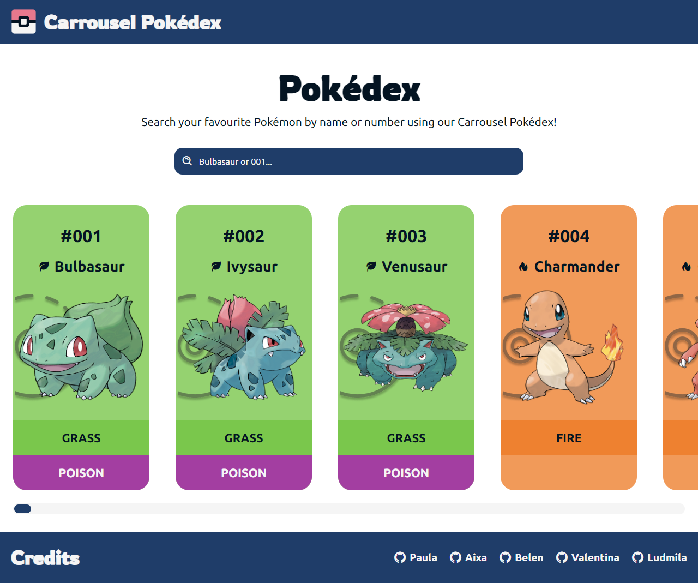
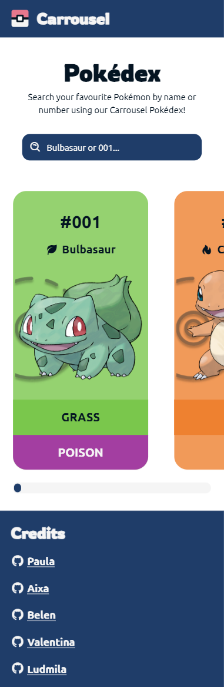

# Carrousel Pokédex - Pokédex Group Project

This project was created for the Full Stack Web Development Course from [SomosCoders](https://somoscoders.org/es).

## Overview

### The Task

Users should be able to:

- View the optimal layout for the site depending on their device's screen size.
- View a list of all 151 Pokémon, with their types, number and name.
- Search a specific Pokémon by their name or number using the search bar.

### Screenshots, Figma Design and Trello

[Figma File](https://www.figma.com/file/QeHEanoBGyaiO4tKVrVEz6/Pok%C3%A9dex?type=design&node-id=0-1&mode=design&t=K13J3AYMb05mbuDF-0)

[Trello](https://trello.com/b/soCxGvwR/empujar-grupo-4)

### Live Site

- Live Site URL: [Pokédex](pokedex-ashy-theta.vercel.app)

### Built with

- Semantic HTML5 markup
- CSS custom properties
- Flexbox
- JavaScript
- Mobile-first workflow

## Authors

- Linkedin - [Valentina Belén Sánchez](https://www.linkedin.com/in/valentina-belen-sanchez/)
- Github - [ValentinaBS](https://github.com/ValentinaBS)
- Linkedin - [Aixa Flores Santillan](https://www.linkedin.com/in/aixa-flores-santillan/)
- Github - [AixaFlores](https://github.com/AixaFlores)
- Linkedin - [Ludmila Agostinelli](https://www.linkedin.com/in/ludmila-agostinelli-2a004a27b/)
- Github - [ludm1](https://github.com/ludm1)
- Linkedin - [Paula Cizmadija](https://www.linkedin.com/in/paulacizmadija/)
- Github - [Paucizmadija](https://github.com/Paucizmadija)
- Linkedin - [Belén Delgadillo Arias](https://www.linkedin.com/in/belen-delgadillo-arias-349043251)
- Github - [BelenDelgadilloArias](https://github.com/BelenDelgadilloArias)

---

# Carrusel Pokédex - Proyecto de Pokédex Grupal

Este proyecto fue creado para el curso de Desarrollo Web Full Stack de [SomosCoders](https://somoscoders.org/es).

## Visión General

### La Tarea

Los usuarios deberían ser capaces de:

- Ver el diseño óptimo del sitio en función del tamaño de la pantalla de su dispositivo.
- Ver un lista con los 151 Pokémon, con sus tipos, número y nombre.
- Buscar un Pokémon específico por su nombre o número usando la barra de búsqueda.

### Screenshots & Figma

[Archivo de Figma](https://www.figma.com/file/QeHEanoBGyaiO4tKVrVEz6/Pok%C3%A9dex?type=design&node-id=0-1&mode=design&t=K13J3AYMb05mbuDF-0)

[Trello](https://trello.com/b/soCxGvwR/empujar-grupo-4)

### Sitio Web

- URL del Sitio: [Pokédex](pokedex-ashy-theta.vercel.app)

### Hecho con

- HTML5 Semántico
- CSS
- Flexbox
- JavaScript
- Flujo de trabajo Mobile-first

## Autoras

- Linkedin - [Valentina Belén Sánchez](https://www.linkedin.com/in/valentina-belen-sanchez/)
- Github - [ValentinaBS](https://github.com/ValentinaBS)
- Linkedin - [Aixa Flores Santillan](https://www.linkedin.com/in/aixa-flores-santillan/)
- Github - [AixaFlores](https://github.com/AixaFlores)
- Linkedin - [Ludmila Agostinelli](https://www.linkedin.com/in/ludmila-agostinelli-2a004a27b/)
- Github - [ludm1](https://github.com/ludm1)
- Linkedin - [Paula Cizmadija](https://www.linkedin.com/in/paulacizmadija/)
- Github - [Paucizmadija](https://github.com/Paucizmadija)
- Linkedin - [Belén Delgadillo Arias](https://www.linkedin.com/in/belen-delgadillo-arias-349043251)
- Github - [BelenDelgadilloArias](https://github.com/BelenDelgadilloArias)